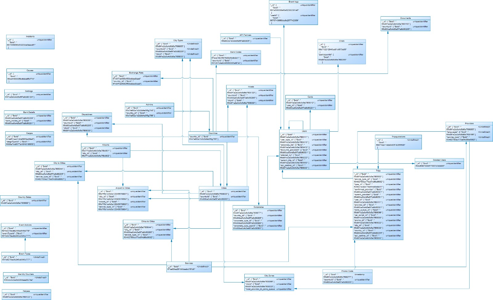

### Grafo Relacional
EL objetivo es mostrar como se encuentran distribuidas y asociadas las distintas colecciones de documentos en la base de datos Actual



A continuación se muestra la definición de las colecciones existentes en el esquema flety_dev 
 de la base de datos en Mongo del sistema.

### Settings - Collection
 
```json
//// Settings
{
  "_id": { "$oid": "64f1a2b3c4d5e6f7a8b90124" },
  "provider_timeout": "Number",
  "countryname": "String",
  "adminCurrencyCode": "String",
  "adminCurrency": "String",
  "adminTimeZone": "String",
  "sms_notification": "Boolean",
  "email_notification": "Boolean",
  "push_notification": "Boolean",
  "get_referral_profit_on_card_payment": "Boolean",
  "get_referral_profit_on_cash_payment": "Boolean",
  "userEmailVerification": "Boolean",
  "providerEmailVerification": "Boolean",
  "userSms": "Boolean",
  "providerSms": "Boolean",
  "admin_phone": "String",
  "contactUsEmail": "String",
  "twilio_call_masking": "Boolean",
  "access_key_id": "String",
  "secret_key_id": "String",
  "aws_bucket_name": "String",
  "is_use_aws_bucket": "Boolean",
  "image_base_url": "String",
  "is_ride_share": "Boolean",
  "is_split_payment": "Boolean",
  "max_split_user": "Number",
  "admin_email": "String",
  "default_Search_radious": "Number",
  "scheduled_request_pre_start_minute": "Number",
  "scheduled_request_day_limit": "Number",
  "number_of_try_for_scheduled_request": "Number",
  "is_public_demo": "Boolean",
  "is_provider_initiate_trip": "Boolean",
  "stripe_secret_key": "String",
  "stripe_publishable_key": "String",
  "paystack_secret_key": "String",
  "paystack_publishable_key": "String",
  "payu_key": "String",
  "payu_salt": "String",
  "payment_gateway_type": "Number",
  "email": "String",
  "password": "String",
  "domain": "String",
  "provider_offline_min": "Number",
  "smtp_host": "String",
  "smtp_port": "String",
  "is_show_estimation_in_provider_app": "Boolean",
  "is_show_estimation_in_user_app": "Boolean",
  "twilio_account_sid": "String",
  "twilio_auth_token": "String",
  "twilio_number": "String",
  "twiml_url": "String",
  "userPath": "Boolean",
  "providerPath": "Boolean",
  "android_client_app_url": "String",
  "android_driver_app_url": "String",
  "ios_client_app_url": "String",
  "ios_driver_app_url": "String",
  "find_nearest_driver_type": "Number",
  "request_send_to_no_of_providers": "Number",
  "android_user_app_gcm_key": "String",
  "android_provider_app_gcm_key": "String",
  "android_user_app_google_key": "String",
  "android_provider_app_google_key": "String",
  "ios_user_app_google_key": "String",
  "ios_provider_app_google_key": "String",
  "web_app_google_key": "String",
  "road_api_google_key": "String",
  "backend_google_key": "String",
  "user_passphrase": "String",
  "provider_passphrase": "String",
  "ios_certificate_mode": "String",
  "hotline_app_id": "String",
  "hotline_app_key": "String",
  "google_map_lic_key": "String",
  "is_google_map_lic_key_expired": "Number",
  "server_url": "String",
  "app_name": "String",
  "partner_panel_name": "String",
  "dispatcher_panel_name": "String",
  "hotel_panel_name": "String",
  "corporate_panel_name": "String",
  "is_tip": "Boolean",
  "is_toll": "Boolean",
  "timezone_for_display_date": "String",
  "android_user_app_version_code": "String",
  "android_user_app_force_update": "Boolean",
  "android_provider_app_version_code": "String",
  "android_provider_app_force_update": "Boolean",
  "ios_user_app_version_code": "String",
  "ios_user_app_force_update": "Boolean",
  "ios_provider_app_version_code": "String",
  "ios_provider_app_force_update": "Boolean",
  "is_debug_log": "Boolean",
  "location": ["Number"],
  "firebase_apiKey": "String",
  "firebase_authDomain": "String",
  "firebase_databaseURL": "String",
  "firebase_projectId": "String",
  "firebase_storageBucket": "String",
  "firebase_messagingSenderId": "String",
  "user_terms_and_condition": "String",
  "provider_terms_and_condition": "String",
  "user_privacy_policy": "String",
  "provider_privacy_policy": "String",
  "android_places_autocomplete_key": "String",
  "ios_places_autocomplete_key": "String",
  "team_id": "String",
  "key_id": "String",
  "provider_bundle_id": "String",
  "user_bundle_id": "String",
  "type": "String",
  "private_key_id": "String",
  "private_key": "String",
  "client_email": "String",
  "client_id": "String",
  "auth_uri": "String",
  "token_uri": "String",
  "auth_provider_x509_cert_url": "String",
  "client_x509_cert_url": "String",
  "is_user_social_login": "Boolean",
  "is_provider_social_login": "Boolean",
  "is_guest_token": "Boolean",
  "is_otp_verification_start_trip": "Boolean",
  "is_receive_new_request_near_destination": "Boolean",
  "near_destination_radius": "Number",
  "is_driver_go_home": "Boolean",
  "is_driver_go_home_change_address": "Boolean",
  "driver_go_home_radius": "Number",
  "is_allow_multiple_stop": "Boolean",
  "is_multiple_stop_waiting_free_on_each_stop": "Boolean",
  "multiple_stop_count": "Number",
  "is_allow_ride_share": "Boolean",
  "ride_share_pickup_radius": "Number",
  "ride_share_destination_radius": "Number",
  "minimum_phone_number_length": "Number",
  "maximum_phone_number_length": "Number",
  "email_list_trip_notifiy": ["String"],
  "base_url": "String",
  "webpush_public_key": "String",
  "webpush_private_key": "String",
  "server_type": "Number",
  "connectium_key": "String",
  "connectium_base_url": "String",
  "connectium_short_code": "String",
  "connectium_dlr": "String",
  "connectium_dlr_level": "Null",
  "connectium_dlr_webhook_url": "String",
  "stop_threshold": "Number",
  "emails_notify_registration_data": ["String"],
  "tracking_link_sms": "Boolean",
  "landing_page_url": "String",
  "user_app_insta_ad_url": "String",
  "driver_app_insta_ad_url": "String",
  "advertise_urls": ["String"]
}
```


### Admins - Collection

```json
/// Admins
{
  "_id": { "$oid": "65d7e8f2a1b2c3d4e5f6g7h8" },
  "username": "String",
  "password": "String",
  "email": "String",
  "token": "String",
  "type": "Number",
  "url_array": ["String"],
  "created_at": "timestamp",
  "updated_at": "timestamp",
  "uid": "String",
  "country_phone_code": "String",
  "country_id": { "$oid": "65d7e8f2a1b2c3d4e5f6g799" },
  "super_admin": "Number"
}

```

### Aiports - Collection

```json
/// airports
{
  "_id": { "$oid": "65d7f1a2b3c4b5d6e7f8b901" },
  "city_id": { "$oid": "65d7f1a2b3c4b5d6e7f8b902" },
  "title": "String",
  "kmlzone": ["Array"],
  "styleUrl": "String",
  "styleHash": "String",
  "description": "String",
  "stroke": "String",
  "stroke_opacity": "Number",
  "stroke_width": "Number",
  "fill": "String",
  "fill_opacity": "Number",
  "created_at": "timestamp",
  "updated_at": "timestamp"
}
```

### Airport_to_cities - Collection

```json
{
  "_id": { "$oid": "65d7f5b1e4b0a12345678901" },
  "city_id": { "$oid": "65d7f5b1e4b0a12345678902" },
  "airport_id": { "$oid": "65d7f5b1e4b0a12345678903" },
  "price": "Number",
  "service_type_id": { "$oid": "65d7f5b1e4b0a12345678904" },
  "created_at": "timestamp",
  "updated_at": "timestamp"
}
```


### API Partners - Collections

```json
////api_partners
{
  "_id": { "$oid": "65d802a1b3c4d5e6f7a8b905" },
  "name": "String",
  "token": "String",
  "createdAt": "timestamp",
  "updatedAt": "timestamp",
  "__v": "Number"
}

```


### Bank Details - Collections

```json
//// bank_details
{
  "_id": { "$oid": "65d80ba5c4d5e6f7a8b90200" },
  "bank_holder_type": "Number",
  "bank_holder_id": { "$oid": "65d80ba5c4d5e6f7a8b90201" },
  "unique_id": "Number",
  "bank_name": "String",
  "bank_branch": "String",
  "bank_account_number": "String",
  "bank_account_holder_name": "String",
  "bank_beneficiary_address": "String",
  "bank_unique_code": "String",
  "bank_swift_code": "String",
  "is_updated": "Number",
  "created_at": "timestamp",
  "updated_at": "timestamp"
}
```

### Bank Code - Collections
```json
{

  "_id": { "$oid": "67acc18b1687820efdc9c3d1" },
  "code": "String",
  "name": "String",
  "countryId": { "$oid": "631287b4a0d46062285af87e" },
  "created_at": "timestamp",
  "updated_at": "timestamp"
}
```

### Cargos -Collections

```json
{
  "_id": {
    "$oid": "67cef51aad7c8a6869edf4e4"
  },
  "cargoTypeId": {
    "$oid": "6333a7dc6077a18f401066f3"
  },
  "cargoDetails": [
    {
      "totalWeight": "Number",
      "totalVolume": "Number",
      "pickupDate": "timestamp",
      "pickupTime": "String",
      "deliveryDate": "timestamp",
      "deliveryTime": "String"
    }
  ],
  "cargoPhotos": [
    "Array"
  ],
  "description": "String",
  "createdAt": "timestamp",
  "updatedAt": "timestamp"
}
```

### Cards - Collections

```json
{
  "_id": { "$oid": "65d8f1e2a3c4b5d6e7f89012" },
  "payment_method": "String",
  "card_type": "String",
  "user_id": { "$oid": "65d80ba5c4d5e6f7a8b90201" },
  "last_four": "String",
  "customer_id": "String",
  "is_default": "Number",
  "payment_gateway_type": "Number",
  "type": "Number",
  "created_at": "timestamp",
  "updated_at": "timestamp"
}

```

### Causes - Collections

```json
{
  "_id": {
    "$oid": "68cc4480835bcfcbcaf5c77d"
  },
  "name": "String",
  "createdAt": "timestamp",
  "updatedAt": "timestamp"
}
```

### Cities - Collections

```json
//// cities
{
  "_id": { "$oid": "65d8f1e2a3c4b5d6e7f89033" },
  "countryid": { "$oid": "65d80ba5c4d5e6f7a8b90205" },
  "countryname": "String",
  "full_cityname": "String",
  "timezone": "String",
  "cityname": "String",
  "is_use_city_boundary": "Boolean",
  "city_locations": ["Array"],
  "payment_gateway": ["Number"],
  "unit": "Number",
  "is_payment_mode_cash": "Number",
  "is_payment_mode_card": "Number",
  "is_payment_mode_apple_pay": "Number",
  "isPromoApplyForCash": "Number",
  "isPromoApplyForCard": "Number",
  "isBusiness": "Number",
  "airport_business": "Number",
  "city_business": "Number",
  "zone_business": "Number",
  "isCountryBusiness": "Number",
  "destination_city": [
    { "$oid": "65d80ba5c4d5e6f7a8b90206" },
    { "$oid": "65d80ba5c4d5e6f7a8b90207" }
  ],
  "citycode": "String",
  "cityLatLong": ["Number"],
  "cityRadius": "Number",
  "is_ask_user_for_fixed_fare": "Boolean",
  "provider_min_wallet_amount_set_for_received_cash_request": "Number",
  "is_check_provider_wallet_amount_for_received_cash_request": "Boolean",
  "is_provider_earning_set_in_wallet_on_cash_payment": "Boolean",
  "is_provider_earning_set_in_wallet_on_other_payment": "Boolean",
  "is_caracas": "Boolean",
  "main_city": "Number",
  "daily_cron_date": "timestamp",
  "created_at": "timestamp",
  "updated_at": "timestamp"
}

```

### Chats - Collections
```json
{
  "_id": {
    "$oid": "68b712212045cd81cf973c56"
  },
  "referenceId": {
    "$oid": "68b4b38258ecdba30ec54111"
  },
  "onModel": "String",
  "participants": [
    {
      "participantId": {
        "$oid": "65d8f1e2a3c4b5d6e7f89355"
      },
      "participantType": "String"
    }
  ],
  "createdAt": "timestamp",
  "updatedAt": "timestamp"
}
```


### City to Cities - Collections

```json
/// city_to_cities
{
  "_id": { "$oid": "65d8f1e2a3c4b5d6e7f89044" },
  "city_id": { "$oid": "65d80ba5c4d5e6f7a8b90205" },
  "destination_city_id": { "$oid": "65d80ba5c4d5e6f7a8b90233" },
  "price": "Number",
  "service_type_id": { "$oid": "63482780ec17be54c98e9082" },
  "created_at": "timestamp",
  "updated_at": "timestamp"
}

```

### City Types - Collections

```json
/// city_types
{
  "_id": { "$oid": "65d8f1e2a3c4b5d6e7f89055" },
  "countryid": { "$oid": "65d80ba5c4d5e6f7a8b90205" },
  "cityid": { "$oid": "65d8f1e2a3c4b5d6e7f89033" },
  "typeid": { "$oid": "63482593ec17be54c98e8ebd" },
  "user_type_id": { "$oid": "67bc7581c8895882f94bcfc0" },
  "is_hide": "Number",
  "surge_multiplier": "Number",
  "is_surge_hours": "Number",
  "surge_hours": [
    { "is_surge": "Boolean", "day": "String", "day_time": ["Array"] }
  ],
  "min_fare": "Number",
  "base_price": "Number",
  "base_price_distance": "Number",
  "base_price_time": "Number",
  "price_per_unit_distance": "Number",
  "price_for_total_time": "Number",
  "waiting_time_start_after_minute": "Number",
  "price_for_waiting_time": "Number",
  "tax": "Number",
  "cancellation_fee": "Number",
  "cost_per_helper": "Number",
  "cost_travel_insurance": "Number",
  "ferry_ticket_price": "Number",
  "night_shift": "Number",
  "price_per_km_a": "Number",
  "price_per_km_b": "Number",
  "price_per_km_z": "Number",
  "modelid": [{ "$oid": "65d8f1e2a3c4b5d6e7f89ac1" }],
  "serviceid": [{ "$oid": "65d8f1e2a3c4b5d6e7f89bd2" }],
  "capacityid": [{ "$oid": "65d8f1e2a3c4b5d6e7f89990" }],
  "created_at": "timestamp",
  "updated_at": "timestamp"
}

```

### City Zones - Collelctions

```json
{
  "_id": { "$oid": "65d8f1e2a3c4b5d6e7f89066" },
  "cityid": { "$oid": "65d8f1e2a3c4b5d6e7f89033" },
  "title": "String",
  "cityname": "String",
  "styleUrl": "String",
  "styleHash": "String",
  "description": "String",
  "stroke": "String",
  "stroke_opacity": "Number",
  "stroke_width": "Number",
  "fill": "String",
  "fill_opacity": "Number",
  "total_provider_in_zone_queue": [
    { "$oid": "65d80ba5c4d5e6f7a8b90501" },
    { "$oid": "65d80ba5c4d5e6f7a8b90502" }
  ],
  "kmlzone": [
    ["Number", "Number"]
  ],
  "created_at": "timestamp",
  "updated_at": "timestamp"
}
```

### Corporates - Collections

```json
//// corporates
{
  "_id": { "$oid": "65d8f1e2a3c4b5d6e7f89077" },
  "unique_id": "Number",
  "company_name": "String",
  "rif": "String",
  "name": "String",
  "password": "String",
  "email": "String",
  "country_phone_code": "String",
  "phone": "String",
  "address": "String",
  "country_id": { "$oid": "65d80ba5c4d5e6f7a8b90205" },
  "country_name": "String",
  "wallet_currency_code": "String",
  "customer_id": "String",
  "stripe_doc": "String",
  "account_id": "String",
  "bank_id": "String",
  "token": "String",
  "is_approved": "Number",
  "wallet": "Number",
  "refferal_code": "String",
  "last_transferred_date": "timestamp",
  "is_own_service_type": "Number",
  "picture": "String",
  "rif_url": "String",
  "document_2": "String",
  "alt_phone": "String",
  "uid": "String",
  "corporate_type_id": { "$oid": "65d80ba5c4d5e6f7a8b90900" },
  "corporate_type_userid": { "$oid": "65d80ba5c4d5e6f7a8b90901" },
  "url_array": ["String"],
  "is_trip_approve": "Number",
  "is_subcorporate_admin": "Number",
  "is_hide_amount": "Number",
  "mass_notifications": ["Array"],
  "preliquidation": "Number",
  "is_use_fixed_partner_profit": "Number",
  "is_damasco": "Number",
  "allow_edit_trip": "Number",
  "active_api": "Boolean",
  "api_key": "String",
  "created_at": "timestamp",
  "updated_at": "timestamp"
}
```

### Countries - Collections

```json
{
  "_id": { "$oid": "65d80ba5c4d5e6f7a8b90205" },
  "countryname": "String",
  "countrycode": "String",
  "alpha2": "String",
  "currency": "String",
  "flag_url": "String",
  "currencycode": "String",
  "currencysign": "String",
  "countrytimezone": "String",
  "country_all_timezone": ["String"],
  "payment_gateways": ["Number"],
  "countryphonecode": "String",
  "isBusiness": "Number",
  "referral_bonus_to_user": "Number",
  "bonus_to_providerreferral": "Number",
  "referral_bonus_to_provider": "Number",
  "bonus_to_userreferral": "Number",
  "phone_number_min_length": "Number",
  "phone_number_length": "Number",
  "is_referral": "Boolean",
  "userreferral": "Number",
  "is_provider_referral": "Boolean",
  "providerreferral": "Number",
  "default_selected": "Boolean",
  "is_auto_transfer": "Boolean",
  "auto_transfer_day": "Number",
  "daily_cron_date": "timestamp",
  "created_at": "timestamp",
  "updated_at": "timestamp",
  "coordinates": {
    "latitude": "String",
    "longitude": "String"
  }
}
```


### Country Datas - Collections

```json
{
  "_id": { "$oid": "65d8f1e2a3c4b5d6e7f89088" },
  "alpha2": "String",
  "alpha3": "String",
  "code": "String",
  "currency_code": "String",
  "decimals": "Number",
  "name": "String",
  "sign": "String",
  "timezones": ["String"],
  "timezones_detail": {
    "key": {
      "rawOffsetInMinutes": "Number",
      "abbreviation": "String",
      "rawFormat": "String"
    }
  },
  "active": "Boolean"
}
```

### Deleted Users - Collections

```json
{
  "_id": {
    "$oid": "68ec6907b9b677097c1ebb94"
  },
  "userId": {
    "$oid": "68ec28e211fa7fa15bf53950"
  },
  "name": "String",
  "email": "String",
  "phoneNumber": "String",
  "provider": "String",
  "reason": "String",
  "createdAt": "timestamp",
  "updatedAt": "timestamp"
}
```
### Dispatchers - Collections

```json
{
  "_id": { "$oid": "65d8f1e2a3c4b5d6e7f89099" },
  "unique_id": "Number",
  "first_name": "String",
  "last_name": "String",
  "password": "String",
  "token": "String",
  "email": "String",
  "country_phone_code": "String",
  "phone": "String",
  "country": "String",
  "countryid": { "$oid": "65d80ba5c4d5e6f7a8b90205" },
  "city": "String",
  "cityid": { "$oid": "65d8f1e2a3c4b5d6e7f89033" },
  "created_at": "timestamp",
  "updated_at": "timestamp"
}

```

### Documents - Collections

```json
{
  "_id": { "$oid": "65d8f1e2a3c4b5d6e7f89110" },
  "unique_id": "Number",
  "countryid": { "$oid": "65d80ba5c4d5e6f7a8b90205" },
  "title": "String",
  "type": "Number",
  "option": "Number",
  "expired_date": "timestamp",
  "issue_date": "timestamp",
  "is_issue_date": "Boolean",
  "is_degree": "Boolean",
  "degree": "String",
  "is_unique_code": "Boolean",
  "is_expired_date": "Boolean",
  "document_for": "Number",
  "created_at": "timestamp",
  "updated_at": "timestamp"
}
```

### Event Actions - Collections

```json
{
  "_id": {
    "$oid": "697b8278ecfb245cb545c778"
  },
  "name": "String",
  "eventTypeId": {
    "$oid": "697b8278ecfb245cb545c777"
  }
}
```

### Event Logs - Collections

```json
{
  "_id": {
    "$oid": "697a599338ef8e52382391e6"
  },
  "userId": {
    "$oid": "66757436f68de9c257742359"
  },
  "action": "String",
  "category": "String",
  "ts": "timestamp",
  "jobId": "String",
  "meta": {
    "username": "String",
    "email": "String",
    "date": "timestamp"
  }
}
```

### Event types - Collections

```json
{
  "_id": { "$oid": "697b8278ecfb245cb545c777" },
  "name": "String"
}
```

### Exchange Rate - Collections

```json
{
  "_id": {
    "$oid": "67d0f7cb630df60bddae8ead"
  },
  "date": "timestamp",
  "currency": "String",
  "baseCurrency": "String",
  "rate": "Number",
  "countryId": {
    "$oid": "631287b4a0d46062285af87e"
  },
  "created_at": "timestamp",
  "updated_at": "timestamp"
}
```

### Identity Counters - Collections

```json
{
  "_id": {
    "$oid": "630ddc3c3a2b2284aea9b74e"
  },
  "model": "String",
  "field": "String",
  "count": "Number"
}
```


### Helpers - Collections

```json
{
  "_id": { "$oid": "65d8f1e2a3c4b5d6e7f89122" },
  "unique_id": "Number",
  "name": "String",
  "cedula": "String",
  "phone": "String",
  "country_phone_code": "String",
  "helper_type_id": { "$oid": "65d80ba5c4d5e6f7a8b90301" },
  "created_at": "timestamp",
  "updated_at": "timestamp"
}
```

### Hotels - Collections

```json
{
  "_id": { "$oid": "65d8f1e2a3c4b5d6e7f89133" },
  "unique_id": "Number",
  "hotel_name": "String",
  "password": "String",
  "token": "String",
  "email": "String",
  "country_phone_code": "String",
  "phone": "String",
  "country": "String",
  "countryid": { "$oid": "65d80ba5c4d5e6f7a8b90205" },
  "city": "String",
  "address": "String",
  "latitude": "Number",
  "longitude": "Number",
  "customer_id": "String",
  "cityid": { "$oid": "65d8f1e2a3c4b5d6e7f89033" },
  "created_at": "timestamp",
  "updated_at": "timestamp"
}

```

### Incidents - Collections
```json
{
  "_id": {
    "$oid": "687556096b63223de9eecdf1"
  },
  "tripId": "String",
  "title": "String",
  "description": "String",
  "incidentDate": "timestamp",
  "clientName": "String",
  "status": "String",
  "cause": "String",
  "createdBy": "String",
  "messages": [
    "Array"
  ],
  "createdAt": "timestamp"
}
```

### Inbox Notifications - Collections

```json
{
  "_id": { "$oid": "65d8f1e2a3c4b5d6e7f89144" },
  "unique_id": "Number",
  "title": "String",
  "message": "String",
  "type": "Number",
  "country_id": { "$oid": "65d80ba5c4d5e6f7a8b90205" },
  "created_at": "timestamp",
  "updated_at": "timestamp"
}
```

### Information - Collections

```json
{
  "_id": { "$oid": "65d8f1e2a3c4b5d6e7f89155" },
  "title": "String",
  "file": "String",
  "description": "String",
  "created_at": "timestamp",
  "updated_at": "timestamp"
}
```

### Lengueages - Collections

```json
{
  "_id": { "$oid": "65d8f1e2a3c4b5d6e7f89166" },
  "unique_id": "Number",
  "name": "String",
  "code": "String",
  "created_at": "timestamp",
  "updated_at": "timestamp"
}

```


### Emails Details - Collections

```json
{
  "_id": { "$oid": "65d8f1e2a3c4b5d6e7f89177" },
  "emailUniqueId": "Number",
  "emailUniqueTitle": "String",
  "emailTitle": "String",
  "emailContent": "String",
  "emailAdminInfo": "String",
  "countryName": "String",
  "countryId": { "$oid": "65d80ba5c4d5e6f7a8b90205" }
}
```

### Emergency Contact Details - Collections

```json
{
  "_id": { "$oid": "65d8f1e2a3c4b5d6e7f89188" },
  "user_id": { "$oid": "65d80ba5c4d5e6f7a8b90111" },
  "name": "String",
  "phone": "String",
  "is_always_share_ride_detail": "Number",
  "created_at": "timestamp",
  "updated_at": "timestamp"
}
```

### Ferry Tickets - Collections

```json
{
  "_id": { "$oid": "65d8f1e2a3c4b5d6e7f89199" },
  "unique_id": "Number",
  "user_id": { "$oid": "65d80ba5c4d5e6f7a8b90111" },
  "user_type": "Number",
  "amount": "Number",
  "ticket_cost": "Number",
  "corporate_id": { "$oid": "65d8f1e2a3c4b5d6e7f89077" },
  "service_type_id": { "$oid": "63482780ec17be54c98e9082" },
  "country_id": { "$oid": "65d80ba5c4d5e6f7a8b90205" },
  "type_id": { "$oid": "63482593ec17be54c98e8ebd" },
  "status": "Number",
  "file_url": "String",
  "created_at": "timestamp",
  "updated_at": "timestamp"
}
```

### Guest Tokens - Collections

```json
{
  "_id": { "$oid": "65d8f1e2a3c4b5d6e7f89211" },
  "unique_id": "Number",
  "token_name": "String",
  "token_value": "String",
  "state": "Boolean",
  "start_date": "timestamp",
  "code_expiry": "timestamp",
  "created_at": "timestamp",
  "updated_at": "timestamp"
}

```

### Messages - Collections

```json
{
  "_id": {
    "$oid": "68791072a83660df34fc0ba2"
  },
  "incidentId": {
    "$oid": "6875586efdeec3d7b07cb28d"
  },
  "senderId": {
    "$oid": "676ea25b71a26f3118eb535b"
  },
  "senderName": "String",
  "text": "String",
  "timestamp": "timestamp"
}
```


### Partner Vehicle Documents - Collections

```json
{
  "_id": { "$oid": "65d8f1e2a3c4b5d6e7f89222" },
  "document_id": { "$oid": "65d8f1e2a3c4b5d6e7f89110" },
  "vehicle_id": { "$oid": "65d80ba5c4d5e6f7a8b90600" },
  "name": "String",
  "partner_id": { "$oid": "65d80ba5c4d5e6f7a8b90700" },
  "option": "Number",
  "document_picture": "String",
  "is_uploaded": "Number",
  "unique_code": "String",
  "expired_date": "timestamp",
  "is_unique_code": "Boolean",
  "is_expired_date": "Boolean",
  "is_document_expired": "Boolean",
  "created_at": "timestamp",
  "updated_at": "timestamp"
}
```

### Partner Weekly Earning - Collections

```json
{
  "_id": { "$oid": "65d8f1e2a3c4b5d6e7f89233" },
  "provider_id": { "$oid": "65d80ba5c4d5e6f7a8b90501" },
  "statement_number": "String",
  "total_distance": "Number",
  "total_time": "Number",
  "total_waiting_time": "Number",
  "total_service_fees": "Number",
  "total_service_surge_fees": "Number",
  "total_service_tax_fees": "Number",
  "service_total": "Number",
  "promo_referral_amount": "Number",
  "total": "Number",
  "total_card_payment": "Number",
  "total_cash_payment": "Number",
  "total_wallet_payment": "Number",
  "total_partner_service_fees": "Number",
  "promo_referral_amount_in_admin_currency": "Number",
  "total_cash_payment_in_admin_currency": "Number",
  "total_card_payment_in_admin_currency": "Number",
  "total_wallet_payment_in_admin_currency": "Number",
  "total_in_admin_currency": "Number",
  "service_total_in_admin_currency": "Number",
  "total_partner_service_fees_in_admin_currency": "Number",
  "total_partner_have_cash": "Number",
  "total_pay_to_partner": "Number",
  "admin_paid": "Number",
  "remaining_amount_to_paid": "Number",
  "date_tag": "String",
  "date_server_timezone": "timestamp",
  "start_date_tag": "String",
  "end_date_tag": "String",
  "start_date_server_timezone": "timestamp",
  "end_date_server_timezone": "timestamp",
  "partner_provider_weekly_earning_ids": [{ "$oid": "65d8f1e2a3c4b5d6e7f89240" }]
}


```

### Partner - Collections
```json
{
  "_id": { "$oid": "65d8f1e2a3c4b5d6e7f89255" },
  "unique_id": "Number",
  "first_name": "String",
  "last_name": "String",
  "rif": "String",
  "password": "String",
  "email": "String",
  "country_phone_code": "String",
  "phone": "String",
  "country": "String",
  "country_id": { "$oid": "65d80ba5c4d5e6f7a8b90205" },
  "wallet_currency_code": "String",
  "is_vehicle_document_uploaded": "Boolean",
  "city_id": { "$oid": "65d8f1e2a3c4b5d6e7f89033" },
  "vehicle_detail": ["Array"],
  "customer_id": "String",
  "stripe_doc": "String",
  "account_id": "String",
  "bank_id": "String",
  "account_number": "String",
  "bank_code": "String",
  "city": "String",
  "address": "String",
  "picture": "String",
  "token": "String",
  "partner_company_name": "String",
  "government_id_proof": "String",
  "is_approved": "Number",
  "wallet": "Number",
  "rif_url": "String",
  "document_2": "String",
  "refferal_code": "String",
  "uid": "String",
  "webpush_config": "Object",
  "mass_notifications": ["Array"],
  "last_transferred_date": "timestamp",
  "created_at": "timestamp",
  "updated_at": "timestamp"
}
```

### Payment Methods - Collections
```json
{
  "_id": {
    "$oid": "67acb4741ea4845a56a2a73d"
  },
  "name": "String",
  "type": "String",
  "countryId": {
    "$oid": "631287b4a0d46062285af87e"
  },
  "paymentData": {
    "status": "Boolean"
  },
  "created_at": "timestamp",
  "updated_at": "timestamp"
}
```

### Payment Transactions - Collections

```json
{
  "_id": { "$oid": "65d8f1e2a3c4b5d6e7f89266" },
  "stripe_public_key": "String",
  "stripe_secret_key": "String",
  "amount": "Number",
  "currency_code": "String",
  "is_schedule_payment": "Boolean",
  "is_payment_paid": "Boolean",
  "no_of_failed_transaction": "Number",
  "max_no_of_transaction": "Number",
  "transaction_detail": ["Array"],
  "card_detail": ["Array"],
  "last_payment_date": "timestamp",
  "is_stop_system": "Boolean",
  "type_detail": ["Array"],
  "created_at": "timestamp",
  "updated_at": "timestamp"
}
```

### Pricing Rules - Collections

```json
{
  "_id": {
    "$oid": "6806854e164abd11dcd945b0"
  },
  "policy_insurance_percentage": "Number"
}
```


### Promo Codes - Collections

```json
{
  "_id": { "$oid": "65d8f1e2a3c4b5d6e7f89277" },
  "promocode": "String",
  "code_value": "Number",
  "code_type": "Number",
  "code_uses": "Number",
  "user_used_promo": "Number",
  "code_uses_per_user": "Number",
  "state": "Number",
  "completed_trips_type": "Number",
  "completed_trips_value": "Number",
  "countryid": { "$oid": "65d80ba5c4d5e6f7a8b90205" },
  "cityid": [
    { "$oid": "65d8f1e2a3c4b5d6e7f89033" }
  ],
  "serviceid": [
    { "$oid": "63482780ec17be54c98e9082" }
  ],
  "start_date": "timestamp",
  "code_expiry": "timestamp",
  "created_at": "timestamp",
  "updated_at": "timestamp"
}

```

### Provider Daily Analytic

```json
{
  "_id": { "$oid": "65d8f1e2a3c4b5d6e7f89288" },
  "unique_id": "Number",
  "provider_id": { "$oid": "65d80ba5c4d5e6f7a8b90501" },
  "date_tag": "String",
  "date_server_timezone": "timestamp",
  "received": "Number",
  "accepted": "Number",
  "rejected": "Number",
  "not_answered": "Number",
  "cancelled": "Number",
  "completed": "Number",
  "acception_ratio": "Number",
  "rejection_ratio": "Number",
  "cancellation_ratio": "Number",
  "completed_ratio": "Number",
  "total_online_time": "Number",
  "online_times": ["Array"],
  "created_at": "timestamp",
  "updated_at": "timestamp"
}
```

### Provider Daily Earning - Collections

```json
{
  "_id": { "$oid": "66c8f1e2a3c4b5d6e7f89311" },
  "provider_id": { "$oid": "65d80ba5c4d5e6f7a8b90501" },
  "provider_type": "Number",
  "provider_type_id": { "$oid": "63482593ec17be54c98e8ebd" },
  "statement_number": "String",
  "total_distance": "Number",
  "total_time": "Number",
  "total_waiting_time": "Number",
  "total_service_fees": "Number",
  "total_service_surge_fees": "Number",
  "total_service_tax_fees": "Number",
  "service_total": "Number",
  "promo_referral_amount": "Number",
  "total": "Number",
  "total_card_payment": "Number",
  "total_cash_payment": "Number",
  "total_wallet_payment": "Number",
  "total_provider_service_fees": "Number",
  "promo_referral_amount_in_admin_currency": "Number",
  "total_cash_payment_in_admin_currency": "Number",
  "total_card_payment_in_admin_currency": "Number",
  "total_wallet_payment_in_admin_currency": "Number",
  "total_in_admin_currency": "Number",
  "service_total_in_admin_currency": "Number",
  "total_provider_service_fees_in_admin_currency": "Number",
  "total_provider_have_cash": "Number",
  "total_pay_to_partner": "Number",
  "date_tag": "String",
  "date_server_timezone": "timestamp",
  "provider_trip_earning_ids": [
    { "$oid": "66c8f1e2a3c4b5d6e7f89401" },
    { "$oid": "66c8f1e2a3c4b5d6e7f89402" }
  ]
}

```

### Provider Documents - Colletions

```json
{
  "_id": { "$oid": "65d8f1e2a3c4b5d6e7f89322" },
  "document_id": { "$oid": "65d8f1e2a3c4b5d6e7f89110" },
  "provider_id": { "$oid": "65d80ba5c4d5e6f7a8b90501" },
  "name": "String",
  "option": "Number",
  "document_picture": "String",
  "is_uploaded": "Number",
  "unique_code": "String",
  "is_unique_code": "Boolean",
  "issue_date": "timestamp",
  "is_issue_date": "Boolean",
  "expired_date": "timestamp",
  "is_expired_date": "Boolean",
  "is_degree": "Boolean",
  "degree": "String",
  "is_document_expired": "Boolean",
  "created_at": "timestamp",
  "updated_at": "timestamp"
}

```

### Provider Vehicle Documents - Collections

```json
{
  "_id": { "$oid": "65d8f1e2a3c4b5d6e7f89333" },
  "document_id": { "$oid": "65d8f1e2a3c4b5d6e7f89110" },
  "vehicle_id": { "$oid": "65d80ba5c4d5e6f7a8b90600" },
  "provider_id": { "$oid": "65d80ba5c4d5e6f7a8b90501" },
  "name": "String",
  "option": "Number",
  "document_picture": "String",
  "is_uploaded": "Number",
  "unique_code": "String",
  "is_unique_code": "Boolean",
  "is_expired_date": "Boolean",
  "expired_date": "timestamp",
  "is_document_expired": "Boolean",
  "created_at": "timestamp",
  "updated_at": "timestamp"
}

```
### Provider Weekly Earning - Collections

```json
{
  "_id": { "$oid": "65d8f1e2a3c4b5d6e7f89344" },
  "provider_id": { "$oid": "65d80ba5c4d5e6f7a8b90501" },
  "provider_type": "Number",
  "provider_type_id": { "$oid": "63482593ec17be54c98e8ebd" },
  "statement_number": "String",
  "total_distance": "Number",
  "total_time": "Number",
  "total_waiting_time": "Number",
  "total_service_fees": "Number",
  "total_service_surge_fees": "Number",
  "total_service_tax_fees": "Number",
  "service_total": "Number",
  "promo_referral_amount": "Number",
  "total": "Number",
  "total_card_payment": "Number",
  "total_cash_payment": "Number",
  "total_wallet_payment": "Number",
  "total_provider_service_fees": "Number",
  "promo_referral_amount_in_admin_currency": "Number",
  "total_cash_payment_in_admin_currency": "Number",
  "total_card_payment_in_admin_currency": "Number",
  "total_wallet_payment_in_admin_currency": "Number",
  "total_in_admin_currency": "Number",
  "service_total_in_admin_currency": "Number",
  "total_provider_service_fees_in_admin_currency": "Number",
  "total_provider_have_cash": "Number",
  "total_pay_to_provider": "Number",
  "admin_paid": "Number",
  "remaining_amount_to_paid": "Number",
  "date_tag": "String",
  "date_server_timezone": "timestamp",
  "start_date_tag": "String",
  "end_date_tag": "String",
  "start_date_server_timezone": "timestamp",
  "end_date_server_timezone": "timestamp",
  "provider_daily_earning_ids": [
    { "$oid": "65d8f1e2a3c4b5d6e7f89299" },
    { "$oid": "65d8f1e2a3c4b5d6e7f89300" }
  ]
}
```

### Providers - Collections

```json
{
  "_id": { "$oid": "65d8f1e2a3c4b5d6e7f89355" },
  "provider_type": "Number",
  "provider_type_id": { "$oid": "63482593ec17be54c98e8ebd" },
  "first_name": "String",
  "last_name": "String",
  "email": "String",
  "phone": "String",
  "languages": [{ "$oid": "65d8f1e2a3c4b5d6e7f89166" }],
  "is_available": "Number", 
  "is_active": "Number",
  "is_approved": "Number",
  "address_location": "Array (Coordinates)",
  "providerLocation": "Array (Coordinates)",
  "bearing": "Number",
  "service_type": { "$oid": "63482780ec17be54c98e9082" },
  "car_model": "String",
  "car_number": "String",
  "rate": "Number",
  "rate_count": "Number",
  "device_token": "String",
  "device_type": "String",
  "referral_code": "String",
  "start_online_time": "timestamp",
  "location_updated_time": "timestamp",
  "created_at": "timestamp",
  "updated_at": "timestamp"
}
```

### Red Zone Area - Collection
```json
{
  "_id": { "$oid": "65d8f1e2a3c4b5d6e7f89388" },
  "cityid": { "$oid": "65d8f1e2a3c4b5d6e7f89033" },
  "title": "String",
  "styleUrl": "String",
  "styleHash": "String",
  "description": "String",
  "stroke": "String",
  "stroke_opacity": "Number",
  "stroke_width": "Number",
  "fill": "String",
  "fill_opacity": "Number",
  "kmlzone": "Array",
  "created_at": "timestamp",
  "updated_at": "timestamp"
}
```

### Request Trip Movings
```json
{
  "_id": {
    "$oid": "67ec9e6dfb2f5e5f9b82fab0"
  },
  "unique_id": "Number",
  "size": "String",
  "description": "String",
  "items_quantity": "Number",
  "status": "String",
  "need_packaging": "Boolean",
  "need_helpers": "Boolean",
  "pickup_details": {
    "address": "String",
    "location": [
      {
        "address": "String",
        "location": [
          "Number",
          "Number"
        ],
        "_id": {
          "$oid": "67ec9e6dfb2f5e5f9b82fab1"
        }
      }
    ]
  },
  "stops_details": [
    "Array"
  ],
  "delivery_details": {
    "address": "String",
    "location": [
      {
        "_id": {
          "$oid": "67ec9e6dfb2f5e5f9b82fab3"
        }
      }
    ]
  },
  "create_at": "timestamp"
}
```

### User Request Corporate
```json
{
  "_id": { "$oid": "65d8f1e2a3c4b5d6e7f89410" },
  "unique_id": "Number",
  "country": "String",
  "city": "String",
  "name": "String",
  "email": "String",
  "address": "String",
  "phone": "String",
  "countryCode": "String",
  "password": "String",
  "logo": "Buffer",
  "document": "Buffer",
  "status": "String",
  "created_at": "timestamp",
  "updated_at": "timestamp"
}
```

### Reviews - Collections

```json
{
  "_id": { "$oid": "65d8f1e2a3c4b5d6e7f89450" },
  "userRating": "Number",
  "userReview": "String",
  "userName": "String",
  "providerRating": "Number",
  "providerReview": "String",
  "providerRatingDestination": "Number",
  "providerReviewDestination": "String",
  "trip_id": { "$oid": "65d8f1e2a3c4b5d6e7f89999" },
  "trip_unique_id": "Number",
  "user_id": { "$oid": "65d8f1e2a3c4b5d6e7f89111" },
  "provider_id": { "$oid": "65d8f1e2a3c4b5d6e7f89555" },
  "created_at": "timestamp",
  "updated_at": "timestamp"
}
```

### Services - Collections

```json
{
  "_id": {
    "$oid": "67cef2fee201b0deebc191b8"
  },
  "title": "String",
  "identifier": "String",
  "icon": "String",
  "createdAt": "timestamp",
  "updatedAt": "timestamp"
}
```


### Service Specifications - Collections

```json
{
  "_id": { "$oid": "65d8f1e2a3c4b5d6e7f89480" },
  "unique_id": "Number",
  "specification_name": "String",
  "specification_note": "String",
  "state": "Number",
  "created_at": "timestamp",
  "updated_at": "timestamp"
}

```

### Sms Details - Collections

```json
{
  "_id": { "$oid": "65d8f1e2a3c4b5d6e7f89510" },
  "smsUniqueId": "Number",
  "smsUniqueTitle": "String",
  "smsContent": "String"
}
```

### State by Countries - Collections

```json
{
  "_id": { "$oid": "65d8f1e2a3c4b5d6e7f89550" },
  "unique_id": "Number",
  "type": "String",
  "country_name": "String",
  "country_id": { "$oid": "65d80ba5c4d5e6f7a8b90205" },
  "state_name": "String",
  "features": "Array",
  "state_number": "Number"
}
```

### Transfer Histories - Collections

```json
{
  "_id": { "$oid": "65d8f1e2a3c4b5d6e7f89600" },
  "unique_id": "Number",
  "user_type": "Number",
  "user_id": { "$oid": "65d80ba5c4d5e6f7a8b90501" },
  "country_id": { "$oid": "65d80ba5c4d5e6f7a8b90205" },
  "amount": "Number",
  "currency_code": "String",
  "transfer_status": "Number",
  "transfered_by": "Number",
  "error": "Object",
  "transfer_id": "String",
  "created_at": "timestamp",
  "updated_at": "timestamp"
}
```

### Trip Histories - Collections

```json
{
  "_id": { "$oid": "65d8f1e2a3c4b5d6e7f89700" },
  "unique_id": "Number",
  "optimize_field": "Boolean",
  "invoice_number": "String",
  "provider_language": [{ "$oid": "65d8f1e2a3c4b5d6e7f89166" }],
  "received_trip_from_gender": ["String"],
  "accessibility": ["String"],
  "service_type_id": { "$oid": "63482780ec17be54c98e9082" },
  "service_type_name": "String",
  "type_id": { "$oid": "634821a3ec17be54c98e8e11" },
  "confirmed_provider": { "$oid": "65d80ba5c4d5e6f7a8b90501" },
  "current_provider": { "$oid": "65d80ba5c4d5e6f7a8b90501" },
  "current_providers": [{ "$oid": "65d80ba5c4d5e6f7a8b90501" }],
  "split_payment_users": [
    {
      "user_id": { "$oid": "65d8f1e2a3c4b5d6e7f89111" },
      "first_name": "String",
      "last_name": "String",
      "country_phone_code": "String",
      "phone": "String",
      "email": "String",
      "picture": "String",
      "payment_intent_id": "String",
      "status": "Number",
      "payment_mode": "Number",
      "payment_status": "Number",
      "total": "Number",
      "remaining_payment": "Number",
      "cash_payment": "Number",
      "card_payment": "Number",
      "wallet_payment": "Number"
    }
  ],
  "providers_id_that_rejected_trip": [{ "$oid": "65d80ba5c4d5e6f7a8b90502" }],
  "user_id": { "$oid": "65d8f1e2a3c4b5d6e7f89111" },
  "provider_id": { "$oid": "65d80ba5c4d5e6f7a8b90501" },
  "trip_service_city_type_id": { "$oid": "65d8f1e2a3c4b5d6e7f89033" },
  "zone_queue_id": { "$oid": "65d8f1e2a3c4b5d6e7f89099" },
  "is_trip_inside_zone_queue": "Boolean",
  "is_favourite_provider": "Boolean",
  "speed": "Number",
  "bearing": "Number",
  "payment_gateway_type": "Number",
  "trip_type": "Number",
  "car_rental_id": { "$oid": "65d8f1e2a3c4b5d6e7f89088" },
  "pickup_details": "Array",
  "delivery_details": "Array",
  "user_type": "Number",
  "image_url": ["String"],
  "provider_type": "Number",
  "user_type_id": { "$oid": "65d8f1e2a3c4b5d6e7f89410" },
  "provider_type_id": { "$oid": "63482593ec17be54c98e8ebd" },
  "payment_id": "Number",
  "room_number": "String",
  "floor": "Number",
  "provider_first_name": "String",
  "provider_last_name": "String",
  "user_first_name": "String",
  "user_last_name": "String",
  "payment_intent_id": "String",
  "tip_payment_intent_id": "String",
  "payment_status": "Number",
  "is_provider_accepted": "Number",
  "is_provider_status": "Number",
  "is_trip_end": "Number",
  "is_trip_completed": "Number",
  "is_trip_cancelled": "Number",
  "is_trip_cancelled_by_user": "Number",
  "trip_type_amount": "Number",
  "is_trip_cancelled_by_provider": "Number",
  "is_min_fare_used": "Number",
  "is_user_rated": "Number",
  "is_provider_rated": "Number",
  "is_user_destination_rated": "Number",
  "capacity_details": "Object",
  "model_details": "Object",
  "service_details": "Object",
  "selected_courier_type": "Number",
  "user_app_version": "String",
  "provider_app_version": "String",
  "user_device_type": "String",
  "provider_device_type": "String",
  "provider_to_user_estimated_distance": "Number",
  "provider_to_user_estimated_time": "Number",
  "admin_assigned_partner_id": { "$oid": "65d8f1e2a3c4b5d6e7f89077" },
  "assigned_provider_id": { "$oid": "65d80ba5c4d5e6f7a8b90501" },
  "assigned_provider_details": "Object",
  "assigned_vehicle_id": { "$oid": "65d80ba5c4d5e6f7a8b90600" },
  "assigned_vehicle_details": "Object",
  "assigned_vehicle_id_2": { "$oid": "65d80ba5c4d5e6f7a8b90601" },
  "assigned_vehicle_details_2": "Object",
  "assigned_partner_name": "String",
  "start_date_tag": "timestamp",
  "trip_assigned_by": "Number",
  "is_provider_confirm_trip": "Number",
  "is_no_provider_found": "Boolean",
  "is_user_invoice_show": "Number",
  "is_provider_invoice_show": "Number",
  "is_surge_hours": "Number",
  "surge_multiplier": "Number",
  "is_cancellation_fee": "Number",
  "is_paid": "Number",
  "is_pending_payments": "Number",
  "wallet_payment": "Number",
  "total_after_wallet_payment": "Number",
  "remaining_payment": "Number",
  "is_tip": "Boolean",
  "tip_amount": "Number",
  "is_toll": "Boolean",
  "toll_amount": "Number",
  "source_address": "String",
  "destination_address": "String",
  "initial_destination_address": "String",
  "sourceLocation": ["Number"],
  "initialDestinationLocation": ["Number"],
  "destinationLocation": ["Number"],
  "providerPreviousLocation": ["Number"],
  "providerLocation": ["Number"],
  "find_nearest_provider_time": "timestamp",
  "server_start_time_for_schedule": "timestamp",
  "no_of_time_send_request": "Number",
  "is_schedule_trip": "Boolean",
  "complete_date_tag": "String",
  "complete_date_in_city_timezone": "timestamp",
  "promo_id": { "$oid": "65d8f1e2a3c4b5d6e7f89022" },
  "currency": "String",
  "currencycode": "String",
  "admin_currency": "String",
  "admin_currencycode": "String",
  "unit": "Number",
  "timezone": "String",
  "cancel_reason": "String",
  "payment_error": "String",
  "payment_error_message": "String",
  "total_distance": "Number",
  "total_time": "Number",
  "total_waiting_time": "Number",
  "total_stop_waiting_time": "Number",
  "base_distance_cost": "Number",
  "city_id": { "$oid": "65d8f1e2a3c4b5d6e7f89033" },
  "country_id": { "$oid": "65d80ba5c4d5e6f7a8b90205" },
  "is_fixed_fare": "Boolean",
  "fixed_price": "Number",
  "is_provider_earning_set_in_wallet": "Boolean",
  "is_transfered": "Boolean",
  "provider_have_cash": "Number",
  "pay_to_provider": "Number",
  "provider_income_set_in_wallet": "Number",
  "payment_transaction": "Array",
  "pod_image_url": ["String"],
  "refund_amount": "Number",
  "is_amount_refund": "Boolean",
  "distance_cost": "Number",
  "time_cost": "Number",
  "waiting_time_cost": "Number",
  "stop_waiting_time_cost": "Number",
  "total_service_fees": "Number",
  "tax_fee": "Number",
  "user_miscellaneous_fee": "Number",
  "provider_miscellaneous_fee": "Number",
  "user_tax_fee": "Number",
  "provider_tax_fee": "Number",
  "total_after_tax_fees": "Number",
  "surge_fee": "Number",
  "total_after_surge_fees": "Number",
  "promo_payment": "Number",
  "total_after_promo_payment": "Number",
  "referral_payment": "Number",
  "total_after_referral_payment": "Number",
  "total": "Number",
  "payment_mode": "Number",
  "cash_payment": "Number",
  "card_payment": "Number",
  "current_rate": "Number",
  "wallet_current_rate": "Number",
  "provider_service_fees": "Number",
  "total_in_admin_currency": "Number",
  "service_total_in_admin_currency": "Number",
  "provider_service_fees_in_admin_currency": "Number",
  "total_after_user_tax_fees": "Number",
  "provider_profit_fees": "Number",
  "user_create_time": "timestamp",
  "schedule_start_time": "timestamp",
  "accepted_time": "timestamp",
  "provider_arrived_time": "timestamp",
  "provider_arrived_destination_time": "timestamp",
  "provider_trip_start_time": "timestamp",
  "provider_trip_end_time": "timestamp",
  "destination_addresses": "Array",
  "actual_destination_addresses": "Array",
  "is_ride_share": "Boolean",
  "ride_share_limit": "Number",
  "is_otp_verification": "Boolean",
  "confirmation_code": "Number",
  "model_type": "Number",
  "destination_stops": "Array",
  "helpers_list": [{ "$oid": "65d80ba5c4d5e6f7a8b90505" }],
  "corporate_doc": "Array",
  "estimated_distance": "Number",
  "actual_destination_stops": "Array",
  "notification_review": "Number",
  "old_destination_stops": "Number",
  "specification_details": "Object",
  "sub_corporate_id": { "$oid": "65d8f1e2a3c4b5d6e7f89411" },
  "trip_approved": "Number",
  "main_tripid": { "$oid": "65d8f1e2a3c4b5d6e7f89701" },
  "cancellation_details": "Object",
  "expense_data": "Object",
  "paid_client": "Number",
  "paid_partner": "Number",
  "corporate_notes": "Array",
  "preliquidation": "Number",
  "night_shift": "Number",
  "boat_ticket": "Number",
  "is_damasco": "Number",
  "selected_procedure": "String",
  "selected_transit_service": "String",
  "selected_transit_type_number": "String",
  "drop_trip_status": "Number",
  "unassign_data": "Array",
  "partner_unassign_data": "Array",
  "change_driver_reason": "Array",
  "unload_notification_sent": "Number",
  "api_partner_id": { "$oid": "65d8f1e2a3c4b5d6e7f89000" },
  "created_by": "Number",
  "created_at": "timestamp",
  "updated_at": "timestamp"
}
```

### Trip Locations - Collections

```json
{
  "_id": { "$oid": "65d8f1e2a3c4b5d6e7f89800" },
  "tripID": { "$oid": "65d8f1e2a3c4b5d6e7f89700" },
  "trip_unique_id": "Number",
  "providerStartTime": "timestamp",
  "providerStartLocation": ["Number"],
  "startTripTime": "timestamp",
  "startTripLocation": ["Number"],
  "endTripTime": "timestamp",
  "endTripLocation": ["Number"],
  "providerStartToStartTripLocations": "Array",
  "startTripToEndTripLocations": "Array",
  "arrivedTripToEndTripLocations": "Array",
  "actual_startTripToEndTripLocations": "Array",
  "googlePathStartLocationToPickUpLocation": "String",
  "googlePickUpLocationToDestinationLocation": "String",
  "index_for_that_covered_path_in_google": "Number",
  "google_total_distance": "Number",
  "google_start_trip_to_end_trip_locations": "Array",
  "speed": "Number",
  "created_at": "timestamp",
  "updated_at": "timestamp"
}

```

### Trip Services - Collections

```json
{
  "_id": { "$oid": "65d8f1e2a3c4b5d6e7f89900" },
  "trip_id": { "$oid": "65d8f1e2a3c4b5d6e7f89700" },
  "service_type_id": { "$oid": "63482780ec17be54c98e9082" },
  "city_id": { "$oid": "65d8f1e2a3c4b5d6e7f89033" },
  "service_type_name": "String",
  "min_fare": "Number",
  "provider_profit": "Number",
  "typename": "String",
  "is_car_rental_business": "Number",
  "car_rental_ids": [{ "$oid": "65d8f1e2a3c4b5d6e7f89088" }],
  "base_price_distance": "Number",
  "base_price_time": "Number",
  "base_price": "Number",
  "price_per_unit_distance": "Number",
  "price_for_total_time": "Number",
  "price_for_waiting_time": "Number",
  "waiting_time_start_after_minute": "Number",
  "price_for_waiting_time_multiple_stops": "Number",
  "waiting_time_start_after_minute_multiple_stops": "Number",
  "surge_multiplier": "Number",
  "surge_start_hour": "Number",
  "surge_end_hour": "Number",
  "is_surge_hours": "Number",
  "user_miscellaneous_fee": "Number",
  "provider_miscellaneous_fee": "Number",
  "user_tax": "Number",
  "provider_tax": "Number",
  "tax": "Number",
  "max_space": "Number",
  "cancellation_fee": "Number",
  "model_pricing_ids": [{ "$oid": "65d8f1e2a3c4b5d6e7f89910" }],
  "modelid": "Array",
  "serviceid": "Array",
  "capacityid": "Array",
  "price_per_km_a": "Number",
  "price_per_km_b": "Number",
  "price_per_km_c": "Number",
  "price_per_km_d": "Number",
  "price_per_km_e": "Number",
  "price_per_km_f": "Number",
  "price_per_km_g": "Number",
  "price_per_km_h": "Number",
  "price_per_km_i": "Number",
  "price_per_km_j": "Number",
  "price_per_km_k": "Number",
  "price_per_km_l": "Number",
  "price_per_km_m": "Number",
  "price_per_km_n": "Number",
  "price_per_km_o": "Number",
  "price_per_km_p": "Number",
  "price_per_km_q": "Number",
  "price_per_km_r": "Number",
  "price_per_km_s": "Number",
  "price_per_km_t": "Number",
  "price_per_km_u": "Number",
  "price_per_km_v": "Number",
  "price_per_km_w": "Number",
  "price_per_km_y": "Number",
  "cost_per_stop_inside_city": "Number",
  "cost_per_stop_outside_city": "Number",
  "cost_per_helper": "Number",
  "cost_travel_insurance": "Number",
  "fixed_fees": "Number",
  "model_type": "Number",
  "user_type_id": { "$oid": "65d8f1e2a3c4b5d6e7f89410" },
  "user_type": "Number",
  "corporate_partner_profit_fees": "Number",
  "ti_internal_transit": "Number",
  "ferry_ticket_price": "Number",
  "created_at": "timestamp",
  "updated_at": "timestamp"
}

```

### Trips Collections
```json
{
  "_id": { "$oid": "65d8f1e2a3c4b5d6e7f89950" },
  "unique_id": "Number",
  "invoice_number": "String",
  "provider_language": [{ "$oid": "65d8f1e2a3c4b5d6e7f89166" }],
  "received_trip_from_gender": ["String"],
  "accessibility": ["String"],
  "optimize_field": "Boolean",
  "service_type_id": { "$oid": "63482780ec17be54c98e9082" },
  "service_type_name": "String",
  "type_id": { "$oid": "634821a3ec17be54c98e8e11" },
  "confirmed_provider": { "$oid": "65d80ba5c4d5e6f7a8b90501" },
  "current_provider": { "$oid": "65d80ba5c4d5e6f7a8b90501" },
  "current_providers": [{ "$oid": "65d80ba5c4d5e6f7a8b90501" }],
  "split_payment_users": [
    {
      "user_id": { "$oid": "65d8f1e2a3c4b5d6e7f89111" },
      "first_name": "String",
      "last_name": "String",
      "status": "Number",
      "total": "Number",
      "remaining_payment": "Number"
    }
  ],
  "providers_id_that_rejected_trip": [{ "$oid": "65d80ba5c4d5e6f7a8b90502" }],
  "user_id": { "$oid": "65d8f1e2a3c4b5d6e7f89111" },
  "provider_id": { "$oid": "65d80ba5c4d5e6f7a8b90501" },
  "trip_service_city_type_id": { "$oid": "65d8f1e2a3c4b5d6e7f89033" },
  "zone_queue_id": { "$oid": "65d8f1e2a3c4b5d6e7f89099" },
  "is_trip_inside_zone_queue": "Boolean",
  "is_favourite_provider": "Boolean",
  "speed": "Number",
  "bearing": "Number",
  "trip_type": "Number",
  "car_rental_id": { "$oid": "65d8f1e2a3c4b5d6e7f89088" },
  "user_type": "Number",
  "payment_gateway_type": "Number",
  "provider_type": "Number",
  "image_url": ["String"],
  "pod_image_url": ["String"],
  "user_type_id": { "$oid": "65d8f1e2a3c4b5d6e7f89410" },
  "provider_type_id": { "$oid": "63482593ec17be54c98e8ebd" },
  "payment_id": "Number",
  "room_number": "String",
  "floor": "Number",
  "provider_first_name": "String",
  "provider_last_name": "String",
  "pickup_details": "Array",
  "delivery_details": "Array",
  "user_first_name": "String",
  "user_last_name": "String",
  "payment_intent_id": "String",
  "tip_payment_intent_id": "String",
  "payment_status": "Number",
  "is_provider_accepted": "Number",
  "is_provider_status": "Number",
  "is_trip_end": "Number",
  "is_trip_completed": "Number",
  "is_trip_cancelled": "Number",
  "is_trip_cancelled_by_user": "Number",
  "trip_type_amount": "Number",
  "is_trip_cancelled_by_provider": "Number",
  "is_min_fare_used": "Number",
  "is_user_rated": "Number",
  "is_provider_rated": "Number",
  "selected_courier_type": "Number",
  "user_app_version": "String",
  "provider_app_version": "String",
  "user_device_type": "String",
  "provider_device_type": "String",
  "provider_to_user_estimated_distance": "Number",
  "provider_to_user_estimated_time": "Number",
  "is_user_invoice_show": "Number",
  "is_provider_invoice_show": "Number",
  "is_surge_hours": "Number",
  "surge_multiplier": "Number",
  "is_cancellation_fee": "Number",
  "is_paid": "Number",
  "is_pending_payments": "Number",
  "wallet_payment": "Number",
  "total_after_wallet_payment": "Number",
  "remaining_payment": "Number",
  "is_tip": "Boolean",
  "tip_amount": "Number",
  "is_toll": "Boolean",
  "toll_amount": "Number",
  "source_address": "String",
  "destination_address": "String",
  "initial_destination_address": "String",
  "sourceLocation": ["Number"],
  "initialDestinationLocation": ["Number"],
  "destinationLocation": ["Number"],
  "providerPreviousLocation": ["Number"],
  "providerLocation": ["Number"],
  "find_nearest_provider_time": "timestamp",
  "server_start_time_for_schedule": "timestamp",
  "no_of_time_send_request": "Number",
  "is_schedule_trip": "Boolean",
  "complete_date_tag": "String",
  "complete_date_in_city_timezone": "timestamp",
  "promo_id": { "$oid": "65d8f1e2a3c4b5d6e7f89022" },
  "currency": "String",
  "currencycode": "String",
  "admin_currency": "String",
  "admin_currencycode": "String",
  "unit": "Number",
  "timezone": "String",
  "cancel_reason": "String",
  "payment_error": "String",
  "payment_error_message": "String",
  "total_distance": "Number",
  "total_time": "Number",
  "total_waiting_time": "Number",
  "total_stop_waiting_time": "Number",
  "base_distance_cost": "Number",
  "city_id": { "$oid": "65d8f1e2a3c4b5d6e7f89033" },
  "country_id": { "$oid": "65d80ba5c4d5e6f7a8b90205" },
  "is_fixed_fare": "Boolean",
  "fixed_price": "Number",
  "is_provider_earning_set_in_wallet": "Boolean",
  "is_transfered": "Boolean",
  "provider_have_cash": "Number",
  "pay_to_provider": "Number",
  "provider_income_set_in_wallet": "Number",
  "payment_transaction": "Array",
  "capacity_details": "Object",
  "model_details": "Object",
  "model_type": "Number",
  "service_details": "Object",
  "refund_amount": "Number",
  "is_amount_refund": "Boolean",
  "distance_cost": "Number",
  "time_cost": "Number",
  "waiting_time_cost": "Number",
  "stop_waiting_time_cost": "Number",
  "total_service_fees": "Number",
  "tax_fee": "Number",
  "user_miscellaneous_fee": "Number",
  "provider_miscellaneous_fee": "Number",
  "user_tax_fee": "Number",
  "provider_tax_fee": "Number",
  "total_after_tax_fees": "Number",
  "surge_fee": "Number",
  "total_after_surge_fees": "Number",
  "promo_payment": "Number",
  "total_after_promo_payment": "Number",
  "referral_payment": "Number",
  "total_after_referral_payment": "Number",
  "total": "Number",
  "payment_mode": "Number",
  "cash_payment": "Number",
  "card_payment": "Number",
  "current_rate": "Number",
  "wallet_current_rate": "Number",
  "provider_service_fees": "Number",
  "total_in_admin_currency": "Number",
  "service_total_in_admin_currency": "Number",
  "provider_service_fees_in_admin_currency": "Number",
  "total_after_user_tax_fees": "Number",
  "provider_profit_fees": "Number",
  "user_create_time": "timestamp",
  "schedule_start_time": "timestamp",
  "accepted_time": "timestamp",
  "provider_arrived_time": "timestamp",
  "provider_arrived_destination_time": "timestamp",
  "provider_trip_start_time": "timestamp",
  "provider_trip_end_time": "timestamp",
  "destination_addresses": "Array",
  "actual_destination_addresses": "Array",
  "is_ride_share": "Boolean",
  "ride_share_limit": "Number",
  "is_otp_verification": "Boolean",
  "confirmation_code": "Number",
  "admin_assigned_partner_id": { "$oid": "65d8f1e2a3c4b5d6e7f89077" },
  "assigned_provider_id": { "$oid": "65d80ba5c4d5e6f7a8b90501" },
  "assigned_provider_details": "Object",
  "assigned_vehicle_id": { "$oid": "65d80ba5c4d5e6f7a8b90600" },
  "assigned_vehicle_details": "Object",
  "assigned_vehicle_id_2": { "$oid": "65d80ba5c4d5e6f7a8b90601" },
  "assigned_vehicle_details_2": "Object",
  "assigned_partner_name": "String",
  "assigned_driver_notification_sent": "Number",
  "start_date_tag": "timestamp",
  "trip_assigned_by": "Number",
  "is_provider_confirm_trip": "Number",
  "is_no_provider_found": "Boolean",
  "destination_stops": "Array",
  "old_destination_stops": "Number",
  "helpers_list": [{ "$oid": "65d80ba5c4d5e6f7a8b90505" }],
  "corporate_doc": "Array",
  "estimated_distance": "Number",
  "actual_destination_stops": "Array",
  "notification_review": "Number",
  "specification_details": "Object",
  "sub_corporate_id": { "$oid": "65d8f1e2a3c4b5d6e7f89411" },
  "trip_approved": "Number",
  "main_tripid": { "$oid": "65d8f1e2a3c4b5d6e7f89951" },
  "created_by": "Number",
  "created_at": "timestamp",
  "updated_at": "timestamp",
  "night_shift": "Number",
  "boat_ticket": "Number",
  "cancellation_details": "Object",
  "expense_data": "Object",
  "paid_client": "Number",
  "paid_partner": "Number",
  "corporate_notes": "Array",
  "preliquidation": "Number",
  "is_damasco": "Number",
  "selected_procedure": "String",
  "selected_transit_service": "String",
  "selected_transit_type_number": "String",
  "drop_trip_status": "Number",
  "unassign_data": "Array",
  "partner_unassign_data": "Array",
  "unassigned": "Number",
  "change_driver_reason": "Array",
  "unload_notification_sent": "Number",
  "api_partner_id": { "$oid": "65d8f1e2a3c4b5d6e7f89000" }
}
```

### Tripquotations - Collections
```json
{
  "_id": {
    "$oid": "68074aa11ebe0d051b355508"
  },
  "origin": {
    "lat": "Number",
    "long": "Number"
  },
  "destination": {
    "lat": "Number",
    "long": "Number"
  },
  "tripId": {
    "$oid": "6487a9b0e089c7a9b2f8a1c4"
  },
  "userId": {
    "$oid": "67bc7581c8895882f94bcfc5"
  },
  "cost": "Number",
  "deletedAt": "null",
  "createdAt": "Date",
  "updatedAt": "Date"
}
```

### Truck Types - Collections

```json
{
  "_id": {
    "$oid": "67ee628e01e648a0f2392f11"
  },
  "capacity_kg": "String",
  "capacity_m3": "String",
  "servicesIds": [
    {
      "$oid": "66bc14ccfd6d73cc2026386c"
    },
    {
      "$oid": "66bc147efd6d73cc2026386b"
    },
    {
      "$oid": "66bc138efd6d73cc2026386a"
    },
    {
      "$oid": "66bc1542fd6d73cc2026386d"
    }
  ],
  "types": "String",
  "description": "String"
}
```

### Type Capacities - Collections

```json
{
  "_id": { "$oid": "65d8f1e2a3c4b5d6e7f89990" },
  "unique_id": "Number",
  "capacity_name": "String",
  "value": "Number",
  "state": "Number",
  "unit": "Number",
  "created_at": "timestamp",
  "updated_at": "timestamp"
}
```

### Type Models - Collections

```json
{
  "_id": { "$oid": "65d8f1e2a3c4b5d6e7f89ac1" },
  "unique_id": "Number",
  "model_name": "String",
  "model_image_url": "String",
  "state": "Number",
  "type_service_list": [
    { "$oid": "63482780ec17be54c98e9082" },
    { "$oid": "63482780ec17be54c98e9083" }
  ],
  "sequence": "String",
  "model_type": "Number",
  "created_at": "timestamp",
  "updated_at": "timestamp"
}

```

### Type Vehicle Service

```json
{
  "_id": {
    "$oid": "661741d092e12496e9967e9d"
  },
  "name_english": "String",
  "name_spanish": "String",
  "created_at": "timestamp",
  "updated_at": "timestamp"
}
```

### Type Services - Collections

```json
{
  "_id": { "$oid": "65d8f1e2a3c4b5d6e7f89bd2" },
  "unique_id": "Number",
  "service_name": "String",
  "specification_array": [
    { "$oid": "65d8f1e2a3c4b5d6e7f89cc1" },
    { "$oid": "65d8f1e2a3c4b5d6e7f89cc2" }
  ],
  "courier_type": "Number",
  "state": "Number",
  "created_at": "timestamp",
  "updated_at": "timestamp"
}
```

### Types - Collections
```json
{
  "_id": { "$oid": "65d8f1e2a3c4b5d6e7f89d44" },
  "typename": "String",
  "typename2": "String",
  "description": "String",
  "type_image_url": "String",
  "map_pin_image_url": "String",
  "panel_map_pin_image_url": "String",
  "service_type": "Number",
  "priority": "Number",
  "is_business": "Number",
  "is_default_selected": "Boolean",
  "ride_share_limit": "Number",
  "type_model_list": [
    { "$oid": "65d8f1e2a3c4b5d6e7f89ac1" }
  ],
  "type_service_list": [
    { "$oid": "65d8f1e2a3c4b5d6e7f89bd2" }
  ],
  "type_capacity_list": [
    { "$oid": "65d8f1e2a3c4b5d6e7f89990" }
  ],
  "label_capacity_id": [{ "$oid": "65d8f1e2a3c4b5d6e7f89e10" }],
  "label_measurement_id": [{ "$oid": "65d8f1e2a3c4b5d6e7f89e11" }],
  "label_pallet_id": [{ "$oid": "65d8f1e2a3c4b5d6e7f89e12" }],
  "is_use_model": "Number",
  "sequence": "String",
  "is_use_capacity": "Number",
  "is_use_services": "Number",
  "is_use_specification": "Number",
  "model_type": "Number",
  "created_at": "timestamp",
  "updated_at": "timestamp"
}

```

### User Documents - Collections

```json
{
  "_id": { "$oid": "65d8f1e2a3c4b5d6e7f8a110" },
  "document_id": { "$oid": "63482a17ec17be54c98e9105" },
  "name": "String",
  "user_id": { "$oid": "65d8f1e2a3c4b5d6e7f89111" },
  "option": "Number",
  "document_picture": "String",
  "is_uploaded": "Number",
  "unique_code": "String",
  "expired_date": "timestamp",
  "is_unique_code": "Boolean",
  "is_expired_date": "Boolean",
  "is_document_expired": "Boolean",
  "created_at": "timestamp",
  "updated_at": "timestamp"
}

```

### User Promo Uses - Collections

```json
{
  "_id": { "$oid": "65d8f1e2a3c4b5d6e7f8a250" },
  "promo_id": { "$oid": "65d8f1e2a3c4b5d6e7f89022" },
  "promocode": "String",
  "user_id": { "$oid": "65d8f1e2a3c4b5d6e7f89111" },
  "promo_type": "Number",
  "promo_value": "Number",
  "trip_id": { "$oid": "65d8f1e2a3c4b5d6e7f89700" },
  "user_used_amount": "Number",
  "user_used_amount_in_admin_currency": "Number",
  "created_at": "timestamp",
  "updated_at": "timestamp"
}

```

### Users - Collections

```json
{
  "_id": { "$oid": "65d8f1e2a3c4b5d6e7f89111" },
  "unique_id": "Number",
  "user_type": "Number",
  "user_type_id": { "$oid": "65d8f1e2a3c4b5d6e7f89410" },
  "first_name": "String",
  "last_name": "String",
  "email": "String",
  "country_phone_code": "String",
  "phone": "String",
  "gender": "String",
  "token": "String",
  "password": "String",
  "picture": "String",
  "device_token": "String",
  "device_type": "String",
  "corporate_ids": [{ "$oid": "65d8f1e2a3c4b5d6e7f89412" }],
  "bio": "String",
  "favourite_providers": [{ "$oid": "65d80ba5c4d5e6f7a8b90501" }],
  "address": "String",
  "zipcode": "String",
  "social_unique_id": "String",
  "social_ids": ["String"],
  "login_by": "String",
  "device_timezone": "String",
  "customer_id": "String",
  "city": "String",
  "is_document_uploaded": "Number",
  "referred_by": { "$oid": "65d8f1e2a3c4b5d6e7f89222" },
  "is_referral": "Number",
  "country": "String",
  "total_referrals": "Number",
  "refferal_credit": "Number",
  "corporate_wallet_limit": "Number",
  "wallet": "Number",
  "wallet_currency_code": "String",
  "is_use_wallet": "Number",
  "current_trip_id": { "$oid": "65d8f1e2a3c4b5d6e7f89950" },
  "is_approved": "Number",
  "promo_count": "Number",
  "home_address": "String",
  "work_address": "String",
  "company_details": "Object",
  "home_location": ["Number"],
  "work_location": ["Number"],
  "total_request": "Number",
  "completed_request": "Number",
  "cancelled_request": "Number",
  "app_version": "String",
  "referral_code": "String",
  "rate": "Number",
  "rate_count": "Number",
  "uid": "String",
  "api_partner_id": { "$oid": "65d8f1e2a3c4b5d6e7f89000" },
  "created_at": "timestamp",
  "updated_at": "timestamp"
}

```

### Vehicle Auto Selections - Collections

```json
{
  "_id": {
    "$oid": "661dc4b6215508ee44855105"
  },
  "capacity_id": {
    "$oid": "6332c8cf821da2a600173aee"
  },
  "type_id": {
    "$oid": "63158d0aa0d46062285c15ab"
  },
  "model_id": {
    "$oid": "639dd426c15d67f152e149f7"
  },
  "type_vehicle_service_id": {
    "$oid": "661dcaf0215508ee4485510a"
  },
  "name": "String",
  "boxes": "Boolean",
  "pallets": "Boolean",
  "bulk": "Boolean",
  "moving": "Boolean",
  "new_product": "Boolean",
  "boxes_selection": {
    "cubic_meters": "Number",
    "capacity_weight": "Number"
  },
  "palettes_selection": {
    "amount": "Number"
  },
  "bulk_selection": {
    "sand": "Boolean",
    "debris_trash": "Boolean"
  },
  "new_product_selection": {
    "refrigerators": "Boolean",
    "furniture": "Boolean"
  }
}
```

### Wallet Histories - Collections

```json
{
  "_id": { "$oid": "65d8f1e2a3c4b5d6e7f8b500" },
  "unique_id": "Number",
  "user_type": "Number",
  "user_unique_id": "Number",
  "user_id": { "$oid": "65d8f1e2a3c4b5d6e7f89111" },
  "country_id": { "$oid": "65d80ba5c4d5e6f7a8b90205" },
  "from_amount": "Number",
  "from_currency_code": "String",
  "to_currency_code": "String",
  "current_rate": "Number",
  "wallet_status": "Number",
  "wallet_comment_id": "Number",
  "wallet_description": "String",
  "wallet_info": "String",
  "wallet_amount": "Number",
  "added_wallet": "Number",
  "total_wallet_amount": "Number",
  "created_at": "timestamp",
  "updated_at": "timestamp"
}
```

### Zone Values - Collections

```json
{
  "_id": { "$oid": "65d8f1e2a3c4b5d6e7f8b900" },
  "cityid": { "$oid": "65d8f1e2a3c4b5d6e7f89033" },
  "service_type_id": { "$oid": "63482780ec17be54c98e9082" },
  "from": { "$oid": "65d8f1e2a3c4b5d6e7f89201" },
  "to": { "$oid": "65d8f1e2a3c4b5d6e7f89202" },
  "amount": "Number",
  "partner_profit_fees": "Number",
  "model_id": [{ "$oid": "65d8f1e2a3c4b5d6e7f89ac1" }],
  "cost_per_helper": "Number",
  "night_shift": "Number",
  "boat_ticket": "Number",
  "cost_per_stop_inside_city": "Number",
  "cost_per_stop_outside_city": "Number",
  "partner_profit_type": "Number",
  "ti_zone": "Number",
  "created_at": "timestamp",
  "updated_at": "timestamp"
}
```


**Nota:** Existen 6 colecciones en la base de datos cuya estructura de documento y/o colección se desconoce, a continuación se listan:

1. Clients
2. Corporate Routes
3. Models
4. Thermometers
5. Travel Pricing
6. User Onboarding

